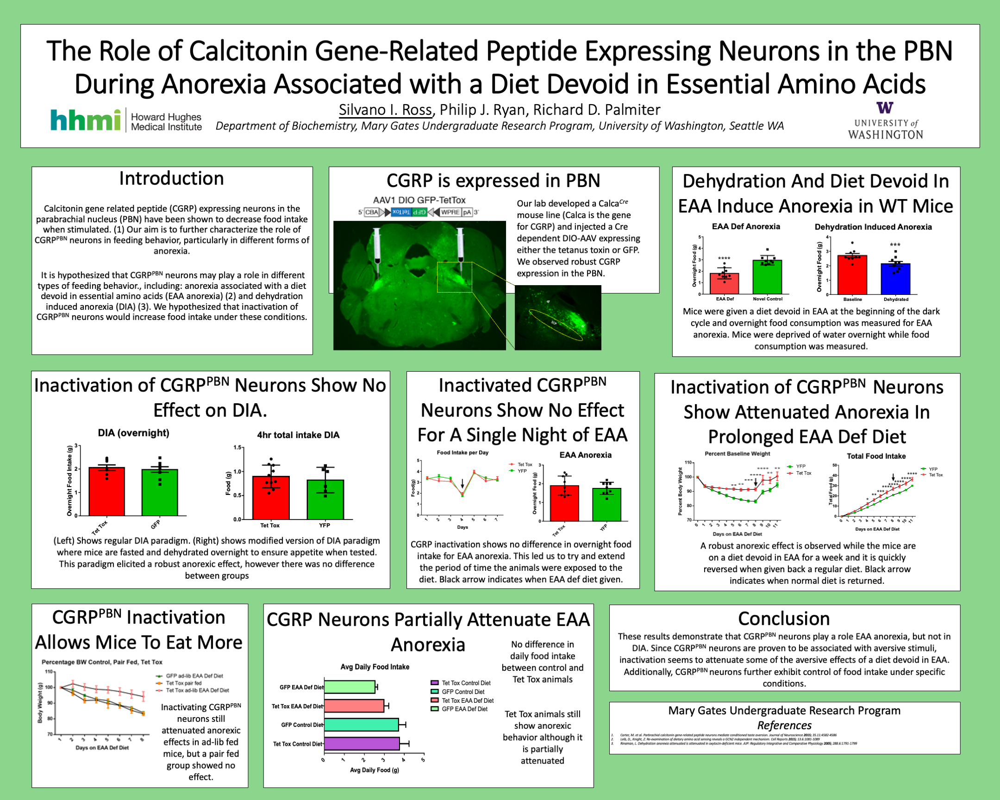

## Mary Gates Undergraduate Research Symposium Spring 2017
**I received a research scholarship for Winter and Spring of 2017 while I 
was an undergraduate at the University of Washington in Seattle. I then 
presented my research findings at the end of the year**

### CGRP neurons in the parabrachial nucleus may play a role in anorexia associated with a diet devoid in essential amino acids

