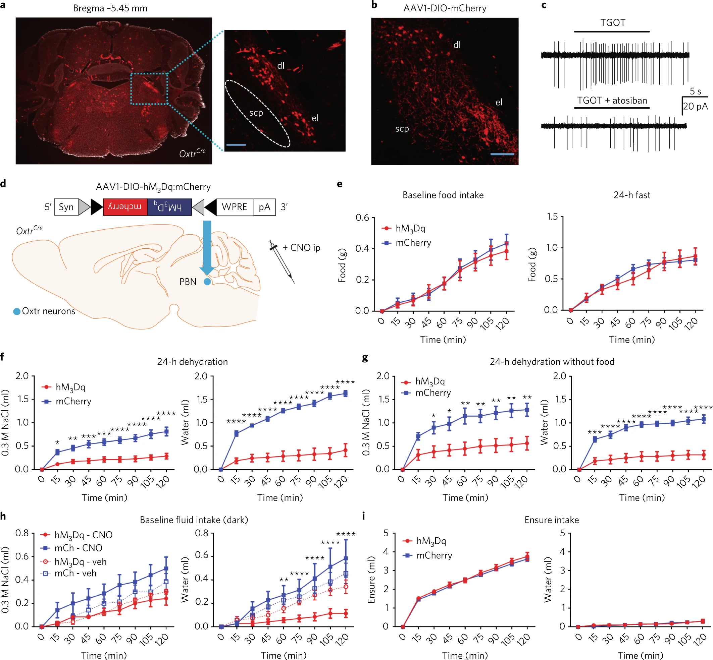
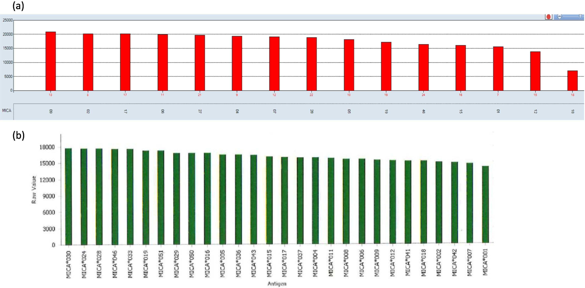

## Nature Neuroscience: 
### Oxytocin-receptor-expressing neurons in the parabrachial nucleus regulate fluid intake
[Full Article Link](https://doi.org/10.1038/s41593-017-0014-z)

**Abstract**

Brain regions that regulate fluid satiation are not well characterized, yet are essential for understanding fluid homeostasis. We found that oxytocin-receptor-expressing neurons in the parabrachial nucleus of mice (OxtrPBN neurons) are key regulators of fluid satiation. Chemogenetic activation of OxtrPBN neurons robustly suppressed noncaloric fluid intake, but did not decrease food intake after fasting or salt intake following salt depletion; inactivation increased saline intake after dehydration and hypertonic saline injection. Under physiological conditions, OxtrPBN neurons were activated by fluid satiation and hypertonic saline injection. OxtrPBN neurons were directly innervated by oxytocin neurons in the paraventricular hypothalamus (OxtPVH neurons), which mildly attenuated fluid intake. Activation of neurons in the nucleus of the solitary tract substantially suppressed fluid intake and activated OxtrPBN neurons. Our results suggest that OxtrPBN neurons act as a key node in the fluid satiation neurocircuitry, which acts to decrease water and/or saline intake to prevent or attenuate hypervolemia and hypernatremia.

---

## Transplant Immunology
### A case study involving dual heart transplant rejections and a potential link to MICA and AT1R antibodies
[Full Article Link](https://doi.org/10.1016/j.trim.2023.101811)

**Background:**

Recipient antibodies against mismatched donor-specific human leukocyte antigens (HLA) are known to be associated with antibody-mediated rejection (AMR), posing increased risks of cardiac allograft vasculopathy (CAV), graft dysfunction, and graft loss after heart transplant (HTx). However, the impact of non-HLA antibodies on HTx outcome is not yet well defined. Case description: Here we report a case of a pediatric patient, who was retransplanted after developing CAV in his first heart allograft. Five years post 2nd HTx, the patient presented with graft dysfunction and mild rejection (ACR 1R, AMR 1H, C4d Neg) in the cardiac biopsy in the absence of HLA donor-specific antibodies (DSAs). We detected strong antibodies against non-HLA antigens, including angiotensin II receptor type 1 (AT1R) and donor- specific MHC class I chain-related gene A (MICA), in the patient's serum that were implicated in the AMR and accelerated CAV of his second allograft, and likely played a role in the loss of his first allograft as well. Conclusion: This case report underscores the clinical relevance of non-HLA antibodies in heart transplantation and highlights the value of incorporating these tests in the immunological risk assessment and post-transplant monitoring of HTx recipients.  

---

