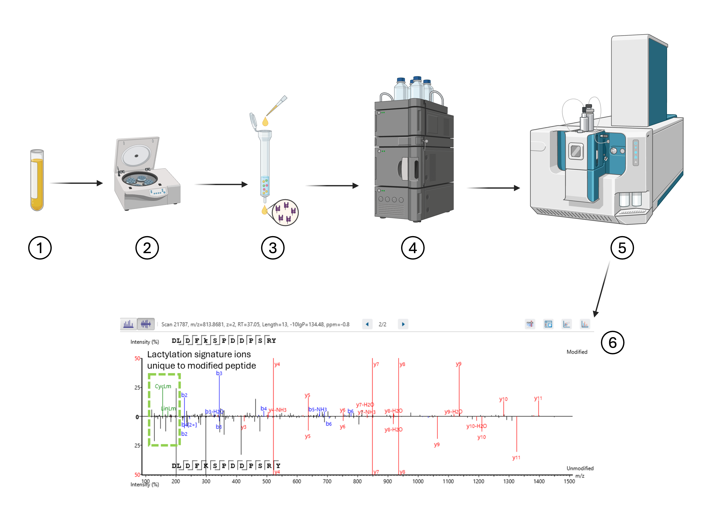
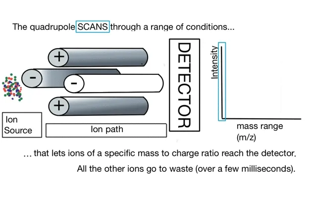
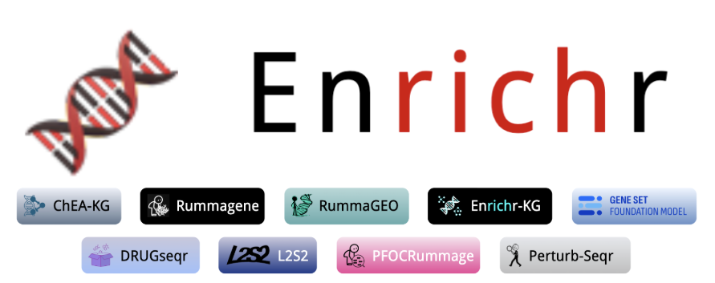

## Overview

### Schematic

1.  Obtain serum sample of plasma
2.  Spin out debris
3.  Run over IP column with anti-class I antibody
4.  Fractionate to purify peptides and exclude large proteins
5.  Use mass spec analysis software to obtain peptide sequences, source proteins, and genes
6.  Perform analysis

### Analysis

Our lab is interested in looking at peak area and peak intensity to see if there are any COVID peptides or disease pathways present and detectable. Peak area is the total abundance throughout the entire sample and peak intensity is a relative abundance as a single ion hits the mass detector.



Cool GIF \[Link\](<https://warwick.ac.uk/fac/sci/lifesci/research/sigtraf/animations/>): 

### Pathway and Gene Ontology Anylsis Packages Used

- gprofiler2 [Link](https://biit.cs.ut.ee/gprofiler/gost)
  - R package for g:Profiler tools g:GOst: Performs functional enrichment analysis 
- enrichR [Link](https://maayanlab.cloud/Enrichr/)
  - Bioconductor package that gives you access to a suite of gene set enrichment analysis tools 
- clusterProfiler [Link](https://bioconductor.org/packages/release/bioc/html/clusterProfiler.html)
  - Bioconductor package for any kind of "Omics" data interpretation: Annotation, Clustering, GO, GeneSetEnrichment, KEGG, MultipleComparison, Pathways, Reactome, Software, Visualization
- enrichplot [Link](https://www.bioconductor.org/packages/devel/bioc/html/enrichplot.html)
  - Bioconductor package for visualization methods for interpreting functional enrichment results from ORA or GSEA analyses, for use with clusterProfiler and is based on ggplot

```{r}
#| include: false
#| echo: false
#| warning: false 
# load libraries
library(tidyverse)
library(dplyr)
library(cowplot)
library(stringr)
library(gprofiler2)
library(enrichR)

```

## Get CSV Output from Mass Spec

```{r}
# read in df
peptides <- read.csv("data/peptideDb.peptides.csv")

# glimpse df
glimpse(peptides)

```

## Clean the Data

```{r}
pep_clean <- peptides |>
  dplyr::select(Peptide, Length, Area.Sample.1, Intensity.Sample.1, Source.File, Accession, Gene, Found.By) |>
  mutate(Peptide = gsub("\\([^()]*\\)", "", Peptide)) |>
  mutate(accession_clean = sub("\\|.*", "", Accession)) |>
  filter(
    !str_detect(Accession, "Biognosys") &
    Found.By == "DB Search" &
    Length <= 14 &
    Length >= 8 &
    !str_detect(Peptide, "^[IL]+$")
  ) |>
  distinct(Peptide, .keep_all = TRUE) |>
  arrange(Length)

# Look at new cleaned df
head(pep_clean)

# export csv to writes filepath
write.csv(pep_clean, "writes/clean_peptide_df.csv", row.names=FALSE)

```

## Visualize Peptide Distribution Based on Length

```{r}
#| code-fold: true
# get total for annotation
total <- dim(pep_clean)[1]

# create x, y coordinates for annotation
annotations <- data.frame(
  x = 7,
  y = 200
)

# create label for annotation
label <- "Total: "

# Make length a factor variable for even distribution
pep_clean$Length <- factor(pep_clean$Length)

# plot
pep_dist_length <- pep_clean |> ggplot(aes(x = Length)) + 
  geom_bar(fill = "steelblue", color = "black") +
  geom_text(data = annotations, aes(x = x, y = y, label = paste(label, total)), 
            size = 4, fontface = "bold") +
  stat_count(geom = "text", aes(label = after_stat(count)), vjust = -0.5) +
  labs(title = "Peptide Distribution by Length",
       y = "Peptide Count") +
  ylim(0, 300) +
  theme_cowplot()

# visualize plot
pep_dist_length

# save plot 
pep_dist_length |>
  ggsave(filename = "plots/dist_len.png", width = 8, height = 6, dpi = 300)
```

## Visualize Peptide Distribution based on Fraction

```{r}
#| code-fold: true
#| echo: false
#| error: false
#| message: false
# get counts for source file
grp_pep <- pep_clean |>
  group_by(Source.File) |>
  count(Source.File)

# rename so easier to read
names <- as.character(11:29)
for (i in 1:19) {
  grp_pep$Source.File[i] <- names[i]
}

# create label for annotation
label <- "Total: "

# turn source file into factor variable
grp_pep$Source.File <- factor(grp_pep$Source.File)

# get total to plot based on grp_pep dataframe
total <- sum(grp_pep$n)
label <- "Total: "

# create annotations for coordinates
annotations <- data.frame(x = 17, y = 85)  # define this with real coords

# plot 
pep_dist_frac <- grp_pep |> ggplot(aes(x = Source.File, y = n)) + 
  geom_col(fill = "#fc6b03", color = "black") +
  geom_text(data = annotations, aes(x = x, y = y, label = paste(label, total)), 
            size = 4, fontface = "bold") +
  geom_text(aes(label = n), vjust = -0.5) +
  labs(title = "Peptide Distribution by Fraction", y = "Peptide Count",
       x = "Fraction Number") +
  ylim(0, 90) +
  theme_cowplot()

# visualize plot
pep_dist_frac

# save to plots filepath
pep_dist_frac |>
  ggsave(filename = "plots/dist_frac.png", width = 8, height = 6, dpi = 300)
```

## Check for COVID-19 Peptides

```{r}
# check for any accession value that does not contain human
non_human <- pep_clean |> filter(!str_detect(Accession, "HUMAN")) 
non_human
```

- We weren't able to identify any COVID-19 peptides from our extraction.

## Identify 15 Most Abundant Peptides Overall Based on Peak Area

**Using gprofiler2**

```{r}
# select for top genes based on sample area
top_area_genes <- pep_clean |> 
  dplyr::select(Gene,accession_clean,Area.Sample.1) |>
  arrange(desc(Area.Sample.1))

genes <- top_area_genes$Gene

# get pathway from API for Gene column using gprofiler
gostres <- gost(query = genes,
                organism = "hsapiens",
                sources = c("GO:BP", "GO:MF", "GO:CC", "KEGG", "REAC"))

# use enrichR
dbs <- c("GO_Biological_Process_2023", "KEGG_2021_Human", "Reactome_2022")

# use gene term to identify terms
enriched <- enrichr(top_area_genes$Gene, dbs)
```

### Top 15 Most Abundant Peptides in COVID Sample

####Kegg Pathways for Abundant Peptides

```{r, fig.width=8, fig.height=6}
# view kegg pathways of enriched df
library(dplyr)
library(ggplot2)
library(tidyr)

# Assuming your enrichR result for KEGG is called enrichr_kegg
plot_df <- enriched$KEGG_2021_Human |>
  # split "Overlap" (e.g. "5/120") into numeric gene count and pathway size
  separate(Overlap, into = c("Count", "Pathway.Size"), sep = "/", convert = TRUE) |>
  arrange(Adjusted.P.value) |>
  slice_head(n = 15)   # top 15 most significant pathways

kegg_abundant <-  ggplot(plot_df, aes(x = reorder(Term, Count), 
                     y = Count, 
                     fill = Adjusted.P.value)) +
  geom_col() +
  coord_flip() +
  scale_fill_gradient(low = "red", high = "blue") +  # low p-adj = red = more significant
  labs(x = "Pathway", y = "Gene Count", fill = "Adj. P-value",
       title = "KEGG Pathway Enrichment for Most Abundant Peptides") +
  theme_minimal()

kegg_abundant

kegg_abundant |>
  ggsave(filename = "plots/kegg_abundant.png", width = 8, height = 6, dpi = 300)
```

#### Reactomes for Most Abundant Peptides

```{r, fig.width=10, fig.height=8}
# Assuming your enrichR result for KEGG is called enrichr_kegg
plot_df <- enriched$Reactome_2022 |>
  # split "Overlap" (e.g. "5/120") into numeric gene count and pathway size
  separate(Overlap, into = c("Count", "Pathway.Size"), sep = "/", convert = TRUE) |>
  arrange(Adjusted.P.value) |>
  slice_head(n = 15)   # top 15 most significant pathways

reactome_abundant <- ggplot(plot_df, aes(x = reorder(Term, Count), 
                     y = Count, 
                     fill = Adjusted.P.value)) +
  geom_col() +
  coord_flip() +
  scale_fill_gradient(low = "red", high = "blue") +  # low p-adj = red = more significant
  labs(x = "Pathway", y = "Gene Count", fill = "Adj. P-value",
       title = "Reactome Terms Most Abundant Peptides") +
  theme_minimal()

reactome_abundant

reactome_abundant |>
  ggsave(filename = "plots/reactome_abundant.png", width = 10, height = 8, dpi = 300)

```

#### Gene Ontology Terms for Abundant Peptides

```{r, fig.width=10, fig.height=8}
head(plot_df)

plot_df <- enriched$GO_Biological_Process_2023 |>
  # split "Overlap" into numeric gene count and pathway size
  separate(Overlap, into = c("Count", "Pathway.Size"), sep = "/", convert = TRUE) |>
  arrange(Adjusted.P.value) |>
  slice_head(n = 15)   # top 15 most significant pathways

GO_abundant <- ggplot(plot_df, aes(x = reorder(Term, Count), 
                     y = Count, 
                     fill = Adjusted.P.value)) +
  geom_col() +
  coord_flip() +
  scale_fill_gradient(low = "red", high = "blue") +  # low p-adj = red = more significant
  labs(x = "Pathway", y = "Gene Count", fill = "Adj. P-value",
       title = "GO Terms Most Abundant Peptides") +
  theme_minimal()

# show plot

GO_abundant

# save plot
GO_abundant |>
  ggsave(filename = "plots/GO_abundant.png", width = 9, height = 8, dpi = 300)
```

### Top 15 Peptides with the Highest Intensity Peaks

```{r}
# select genes based on intensity
top_intensity_genes <- pep_clean |> 
  dplyr::select(Gene, accession_clean,Intensity.Sample.1) |>
  arrange(desc(Intensity.Sample.1))

genes <- top_area_genes$Gene

# get pathway from API for Gene column using gprofiler
gostres <- gost(query = genes,
                organism = "hsapiens",
                sources = c("GO:BP", "GO:MF", "GO:CC", "KEGG", "REAC"))

# use enrichR
dbs <- c("GO_Biological_Process_2023", "KEGG_2021_Human", "Reactome_2022")
enriched <- enrichr(top_area_genes$Gene, dbs)
```

#### KEGG Pathways for Most Intense Peptides

```{r}
# make plot variable
plot_df <- enriched$KEGG_2021_Human |>
  # split "Overlap" nto numeric gene count and pathway size
  separate(Overlap, into = c("Count", "Pathway.Size"), sep = "/", convert = TRUE) |>
  arrange(Adjusted.P.value) |>
  slice_head(n = 15)   # top 15 most significant pathways

kegg_intense <- ggplot(plot_df, aes(x = reorder(Term, Count), 
                     y = Count, 
                     fill = Adjusted.P.value)) +
  geom_col() +
  coord_flip() +
  scale_fill_gradient(low = "red", high = "blue") +  # low p-adj = red = more significant
  labs(x = "Pathway", y = "Gene Count", fill = "Adj. P-value",
       title = "KEGG Pathways Most Intense") +
  theme_minimal()

# show plot
kegg_intense

# save plot

kegg_intense |>
  ggsave(filename = "plots/kegg_intense.png", width = 8, height = 6, dpi = 300)
```

#### Reactome for Most Intense Peptides

```{r, fig.width=10, fig.height=8}
# create the reactome df
plot_df <- enriched$Reactome_2022 |>
  # split "Overlap" into numeric gene count and pathway size
  separate(Overlap, into = c("Count", "Pathway.Size"), sep = "/", convert = TRUE) |>
  arrange(Adjusted.P.value) |>
  slice_head(n = 15)   # top 15 most significant pathways

# create the plot

reactome_plot <- ggplot(plot_df, aes(x = reorder(Term,Count), 
                     y = Count, 
                     fill = Adjusted.P.value)) +
  geom_col() +
  coord_flip() +
  scale_fill_gradient(low = "red", high = "blue") +  # low p-adj = red = more significant
  labs(x = "Pathway", y = "Gene Count", fill = "Adj. P-value",
       title = "Reactome Most Intense") +
  theme_minimal()

# show plot
reactome_plot

# save the plot into plots folder
reactome_plot |>
  ggsave(filename = "plots/reactome_intense.png", width = 10, height = 8, dpi = 300)

```

#### Gene Ontology Terms for Most Intense Peptides

```{r}
# create GO df 
plot_df <- enriched$GO_Biological_Process_2023 |>
  # split "Overlap" into numeric gene count and pathway size
  separate(Overlap, into = c("Count", "Pathway.Size"), sep = "/", convert = TRUE) |>
  arrange(Adjusted.P.value) |>
  slice_head(n = 15)   # top 15 most significant pathways

# create plot into variable
GO_intense <- ggplot(plot_df, aes(x = reorder(Term, Count), 
                     y = Count, 
                     fill = Adjusted.P.value)) +
  geom_col() +
  coord_flip() +
  scale_fill_gradient(low = "red", high = "blue") + 
  labs(x = "Pathway", y = "Gene Count", fill = "Adj. P-value",
       title = "GO Terms Intense") +
  theme_minimal()

# display the plot
GO_intense

# save the plot
GO_intense |>
  ggsave(filename = "plots/GO_intense.png", width = 8, height = 6, dpi = 300)

```

## Use Cluster Profiler on for Most Intense Peptides

```{r}
#| include: false
#| echo: false
#| warning: false 
# load libraries
library(clusterProfiler)
library(org.Hs.eg.db) 
library(AnnotationDbi)
library(ReactomePA)
library(enrichplot)


# convert to entrez ids
id_map <- bitr(genes,
               fromType = "SYMBOL",
               toType   = "ENTREZID",
               OrgDb    = org.Hs.eg.db)

id_map

# run enrichmnet analysis
go_enrich <- enrichGO(gene          = id_map$ENTREZID,
                       OrgDb         = org.Hs.eg.db,
                       keyType       = "ENTREZID",
                       ont           = "ALL",
                       pAdjustMethod = "BH",
                       pvalueCutoff  = 0.05,
                       qvalueCutoff  = 0.2,
                       readable      = TRUE)  

head(as.data.frame(go_enrich))

# run KEGG pathway analysis
kegg_enrich <- enrichKEGG(gene = id_map$ENTREZID, 
                          organism = "hsa", 
                          pvalueCutoff = 0.05)

head(as.data.frame(kegg_enrich))

# run reactome analysis
reactome_enrich <- enrichPathway(gene         = id_map$ENTREZID,
                                  organism     = "human",
                                  pvalueCutoff = 0.05,
                                  readable     = TRUE)

```

#### Kegg Pathways From Cluster Profiler for Most Intense Peptides

```{r}
# use enrichplot barplot to show Kegg pathways with most significant 
barplot(kegg_enrich, showCategory = 15) + 
  ggtitle("Kegg Pathways from Cluster Profiler") 
  
```

#### GO Terms From Cluster Profiler for Most Intense Peptides

```{r, fig.width=7, fig.height=8}
# change fig size

# create plot variable
dot_cluster <- dotplot(go_enrich, showCategory = 15, title="Dot Plot GO Terms Most Intense From Cluster Profiler", font.size = 12) 

# display dot plot of GO terms
dot_cluster 

# save plot
dot_cluster |>  ggsave(filename = "plots/dot_cluster.png", width = 7, height = 9, dpi = 300)

```

#### CNet Plot from Cluster Profiler for Most Intense Peptides

```{r, fig.width=10, fig.height=8}

# create plot variable
cnet_cluster <- cnetplot(go_enrich, showCategory = 15) + 
  ggtitle("CNET Plot From Cluster Profiler")

# display plot
cnet_cluster

# save plot
cnet_cluster |> ggsave(filename = "plots/cnet_cluster.png", width = 10, height = 8, dpi = 300)

```

## Conclusions

- Originally \~2000 peptides were identified, but upon filtering them down there were really only 395 confidently identified peptides that matched documented human database genes/proteins
- No well-documented COVID-19 peptides were identified 😔 (there are only 17 well documented proteins for SARS CoV-2 which are all from the Wuhan strain and don't take into account variants or mutations to proteins)
- Pathway analysis revealed other viral response related proteins to be over-represented in sHLA Class I
  - maybe the COVID response related proteins are not as well characterized as others
  - sHLA does not slough off into the plasma as well for COVID infected cells or COVID prevents this
  - COVID may interfere with class I processing or presentation

### Future Direction

- Currently have another sHLA Class I sample from a COVID infected patient being run on the mass spec set to finish 07/29/2026 @10PM
- Could potentially be a diagnostic of some sort
